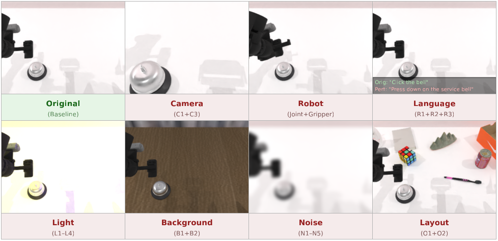
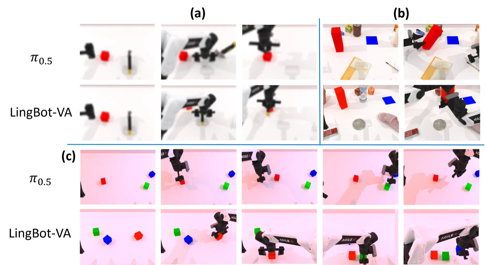

<div align="center">

# Do World Action Models Generalize Better than VLAs? A Robustness Study

**Preprint**

Zhanguang Zhang, Zhiyuan Li, Behnam Rahmati, Rui Heng Yang, Yintao Ma, Amir Rasouli, **Sajjad Pakdamansavoji**, Yangzheng Wu, Lingfeng Zhang, Tongtong Cao, Feng Wen, Xinyu Wang, Xingyue Quan, Yingxue Zhang

¹Huawei Technologies · ²University of Toronto

[](https://arxiv.org/abs/2603.22078)
[](https://sajjadpsavoji.github.io/World-Action-Model-Robustness/)
[](https://huggingface.co/papers/2603.22078)
[](LICENSE)

</div>



---

> **Note**
> This repository is a placeholder. The paper and project page are live; **code release is in progress**.
> Watch or star the repo to be notified when it lands.

## Abstract

Robot action planning in the real world is challenging as it requires not only understanding the current state of the environment but also predicting how it will evolve in response to actions. Vision-language-action (VLA), which repurpose large-scale vision-language models for robot action generation using action experts, have achieved notable success across a variety of robotic tasks. Nevertheless, their performance remains constrained by the scope of their training data, exhibiting limited generalization to unseen scenarios and vulnerability to diverse contextual perturbations. More recently, world models have been revisited as an alternative to VLAs. These models, referred to as world action models (WAMs), are built upon world models that are trained on large corpora of video data to predict future states. With minor adaptations, their latent representation can be decoded into robot actions. It has been suggested that their explicit dynamic prediction capacity, combined with spatiotemporal priors acquired from web-scale video pretraining, enables WAMs to generalize more effectively than VLAs. In this paper, we conduct a comparative study of prominent state-of-the-art VLA policies and recently released WAMs. We evaluate their performance on the LIBERO-Plus and RoboTwin 2.0-Plus benchmarks under various visual and language perturbations. Our results show that WAMs achieve strong robustness, with LingBot-VA reaching 74.2% success rate on RoboTwin 2.0-Plus and Cosmos-Policy achieving 82.2% on LIBERO-Plus. While VLAs such as π_{0.5} can achieve comparable robustness on certain tasks, they typically require extensive training with diverse robotic datasets and varied learning objectives. Hybrid approaches that partially incorporate video-based dynamic learning exhibit intermediate robustness, highlighting the importance of how video priors are integrated.

## News

- **2026-09** &mdash; Paper released on [arXiv](https://arxiv.org/abs/2603.22078) and indexed on [Hugging Face](https://huggingface.co/papers/2603.22078).
- **2026-09** &mdash; Project page live at [sajjadpsavoji.github.io/World-Action-Model-Robustness](https://sajjadpsavoji.github.io/World-Action-Model-Robustness/).

## Getting Started

_Code coming soon._ The intended entry point:

```bash
git clone https://github.com/SajjadPSavoji/World-Action-Model-Robustness.git
cd World-Action-Model-Robustness
pip install -r requirements.txt
```

## Results



_Add a quantitative results table here._

## Citation

If you find this work useful, please cite:

```bibtex
@article{zhang2026do,
  title   = {Do World Action Models Generalize Better than VLAs? A Robustness Study},
  author  = {Zhanguang Zhang and Zhiyuan Li and Behnam Rahmati and Rui Heng Yang and Yintao Ma and Amir Rasouli and Sajjad Pakdamansavoji and Yangzheng Wu and Lingfeng Zhang and Tongtong Cao and Feng Wen and Xinyu Wang and Xingyue Quan and Yingxue Zhang},
  journal = {arXiv preprint arXiv:2603.22078},
  year    = {2026}
}
```

## Links

- 📄 [Paper (arXiv)](https://arxiv.org/abs/2603.22078)
- 🌐 [Project page](https://sajjadpsavoji.github.io/World-Action-Model-Robustness/)
- 🤗 [Hugging Face](https://huggingface.co/papers/2603.22078)
- 👤 [Google Scholar](https://scholar.google.com/citations?user=DZzLzNwAAAAJ)
- 💼 [LinkedIn](https://www.linkedin.com/in/sajjad-pakdaman-savoji/)
- ✉️ [sj.pakdaman.edu@gmail.com](mailto:sj.pakdaman.edu@gmail.com)

## Contact

For questions about the paper, data, or code release, contact
**Sajjad Pakdamansavoji** &mdash; [sj.pakdaman.edu@gmail.com](mailto:sj.pakdaman.edu@gmail.com).

## Acknowledgements

*Corresponding authors

## License

Released under the [MIT License](LICENSE).
